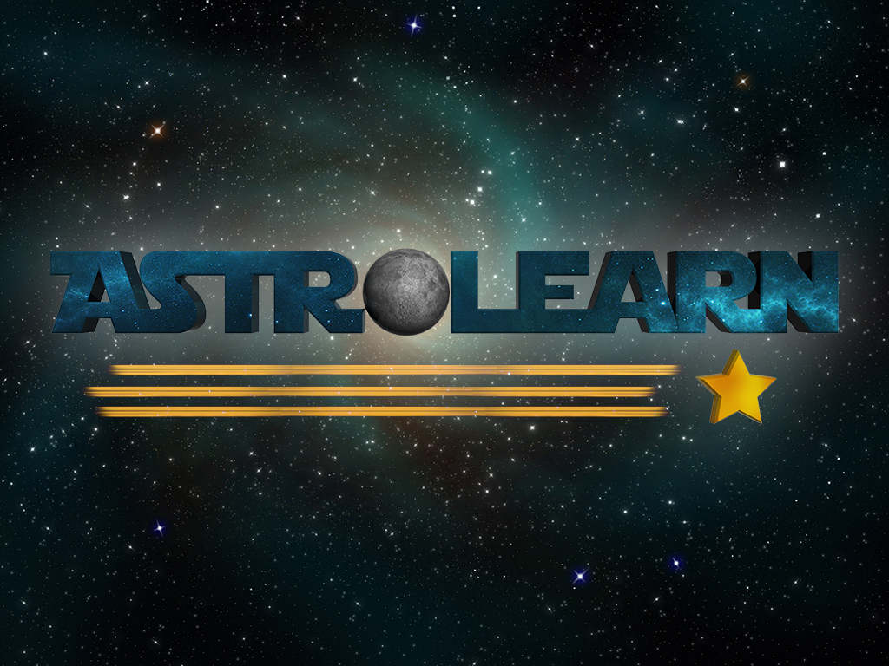
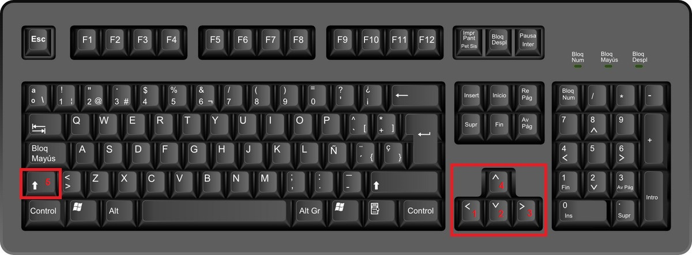
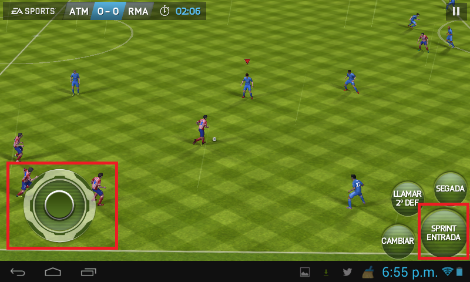

# AstroLearn#

### Ilustración

### Descripción

AstroLearn es un juego educativo que busca enseñar varios conocimientos importantes sobre el sistema solar. Deberás recorrer los planetas para cumplir una serie de misiones que fueron asignadas desde la Agencia Espacial de Costa Rica. Esta institución pretende recolectar bastante información de los astros y que se necesitan para ampliar los conocimientos y fortalecer los datos que se tienen hasta el momento. Además, determinar si existen peligros para nuestro planeta, como el choque de asteroides, algún efecto proveniente del sol, entre otros.

Para eso, tendrás que capturar cierta cantidad de llaves maya para obtener información y otros elementos como tanques de oxígeno, enfriadores de traje, calefactores y herramientas que necesitarás para cumplir los objetivos en cada planeta. Lamentablemente, enfrentaras distintas situaciones que obstaculizarán el recorrido como prominencias, tormentas de arena, entre otros.

Adelante con esta aventura, muchos éxitos.

***
###Ficha Técnica###

* Plataforma de destino: Windows y Android.
* Audiencia: Ideado para adolescentes de 12 a 17 años. Estas edades permiten desarrollar un juego con una historia extensa, lo cual es necesario para ciertos temas de astronomía.
* Productos similares: Existen productos en la tienda Play de Google para Android. Estos son minijuegos para niños que desarrollan principalmente temáticas sobre los planetas, pero no desarrollan una historia, o bien información sobre planetas en forma de enciclopedia. Entre estos están:
	* [Conhecendo o sistema solar](https://play.google.com/store/apps/details?id=air.cienciasjogoConhecendoSistemaSolar) : En este programa se presentan imágenes de los planetas para conocer su orden en el sistema solar.
	* [Solar System 3D](https://play.google.com/store/apps/details?id=stevesk.apps.solarsystem) : Se describen los planetas y se preswnta información en forma de enciclopedia.) : Se presenta información y datos sobre la Tierra en forma de enciclopedia. 

En la App Store no se encontraron referencias a juegos educativos relacionados con astronomía. 
***

### Historia

Una grupo de científicos han decido crear un programa para realizar una serie de misiones en los distintos planetas. Para ello necesitan una persona experimentada que esté de acuerdo en enfrentar los obstáculos más difíciles en su vida. Pero el valor del conocimiento que pensaban obtener era inmenso.

Para poder llevar a cabo su programa, decidieron enviarle una carta a dos grandes astronautas, el problema es que no sabían a cuál de los dos.

Por eso, la agencia ha decidido dejar en tus manos la elección de la persona que realizará las misiones. Acompáñala en una gran aventura y así poder aprender mucho del sistema solar.

Si la persona seleccionada logra cumplir todas las misiones, será colocado o colocada en el salón de la fama de los astronautas.

***
### Flujo del juego###

El desarrollo del juego se centra en un personaje, el cual es un astronauta, seleccionado por el usuario del juego. La pantalla principal del juego muestra el sistema solar y el astronauta deberá pasar los 8 niveles del juego, estos niveles corresponden a cada uno de los planetas del Sistema Solar.

En cada nivel se debe enfrentar a los obstáculos característicos de cada planeta (formaciones rocosas, tormentas de arena, expulsiones de gas, montes, etc...) y debe ir recogiendo estrellas ubicadas a lo largo de la pantalla. Existen varios tipos de estrellas: estrellas para aumentar la puntuación, estrellas sabias que proveen información al jugador y estrellas que dan más vidas al jugador.

Al astronauta se le va a asignar por medio del ISS [qué es esto?] una misión distinta en cada planeta, principalmente para recuperar algún instrumento científico desarrollado por humanos e instalado en el planeta (Curiosity Rover, Messenger, Venus Express, Cassini, Soyuz, Sonda Galileo, Voyager 1 y 2, Telescopio Espacial Hubble) [Es bueno indicar en qué nivel/planeta se recupera cada uno, y mejor aún si existe una relación lógica entre el instrumento y el planeta, ya que el juego es educativo] o cerca del planeta en algunos casos. Si el astronauta logra avanzar y resolver la misión en los 8 niveles habrá completado el juego y será premiado con el ingreso al salón de la fama de los astronautas en la NASA [Sugerencia: Es mejor no involucrar a la NASA, no se tiene el visto bueno de ellos para usar su nombre. Mejor inventarse una agencia ficticia. La historia del juego se encarga de dejar claro lo prestigiosa que es].

***

### Caracteres###

El usuario va a tener el control de un astronauta. El sexo y apariencia del astronauta dependerá de la decisión tomada por el jugador.

El personaje es un experimentado(a) astronauta que desde su infancia se ha visto atraído por las estrellas y los planetas y desde entonces siempre ha querido verlas lo más cerca posible, fue en ese momento cuando se dio cuenta que quería convertirse en un astronauta para poder conseguirlo. Ahora que es uno, su objetivo es completar su carrera profesional, aprender más sobre el sistema solar, lograr convertirse en uno de los mejores astronautas y entrar al salón de la fama.

En los diferentes niveles el astronauta puede realizar cinco tipo de movimientos: caminar, retroceder, inclinarse, saltar y correr, estos se verán afectados por la gravedad, atmósfera y características del planeta en el cual se encuentre. 

***
### Controles###
Para utilizar AstroLearn en Windows la combinación de teclas será la siguiente:

* Caminar: Flecha derecha (3).
* Retroceder: Flecha izquierda (1).
* Inclinarse: Flecha de abajo (2).
* Saltar: Flecha de arriba (4).
* Correr: Combinación de la flecha derecha (3) con shift (5).

Para utilizar el juego en Android se utilizará un emulador de las teclas semejantes a las usadas en Windows. El único cambio será que en lugar del shift se utilizará un botón para acelerar al personaje cuando camina. 

***

### Gameplay

El juego presenta ocho niveles, cada nivel tendrá una misión por cumplir y una serie de obstáculos característicos del planeta y así poder vincular más la realidad con el juego. De esa manera se pretende que haya un proceso enseñanza-aprendizaje. Todas los niveles tienen como característica común la recolección de tanques de oxígeno, combustible, calefactores y enfriadores para el traje que permitirán mantener la estabilidad del traje en las condiciones hostiles de los distintos planetas así como el nivel óptimo de salud del personaje.Además, en los escenarios se podrá encontrar información necesaria para completar la misión en llaves mayas que podrán ser leídas con el sistema computacional que contiene el traje. El motivo de la exploración de los planetas será el aprendizaje que obtendrás, además de la experiencia necesaria para formar parte del prestigioso Salón de la Fama de los astronautas y ser el primer astronauta en lograr visitar todos los planetas del sistema solar. 

######Mercurio

En Mercurio deberás estudiar la superficie y poder determinar el impacto de las radiaciones solares, para eso deberás saltar grandes cráteres que posee dicho planeta. Contarás con el traje espacial que te permite saltar una gran distancia pero en poco tiempo, además, el traje contiene un sistema de enfriamiento que tendrás que pasar por las altas temperaturas. También debes tener cuidado de las emisiones que vienen desde el sol. Debes recolectar una muestra de la superficie antes que ya no encuentres más tanques de oxígeno y botellas de combustible. Ya que el traje dejará de funcionar y no podrás completar la misión, por eso, debes estar pendiente de la estabilidad de tu traje y tu salud, mediante las barras de color que te indicarán cuanto te queda

######Venus

Deberás fortalecer la sonda que han enviado a Venus llamada Messenger, pero lamentablemente solo cuentas con dos horas para poder hacerlo antes que el calor la dañe. Tendrás que enfrentar una superficie rocosa, con cráteres y unas nubes densas. Además de una lluvia de ácido sulfúrico. Pero ten cuidado porque se han registrado estallidos de rayos atmosféricos que harán más complicada la misión. Recuerda que debes recolectar los tanques de combustible y oxígeno necesarios para poder recorrer el planeta.

######Tierra

En la Tierra deberás recorrer un escenario con aspectos característicos del planeta que lo hacen muy diferente de los demás. Recorrerás montañas, llanuras, edificios y mares e irás recolectando información almacenada en llaves mayas que aumentarán tu puntuación final y te brindarán información sobre la misión que debes cumplir en este nivel. La misión será recolectar diversas piezas del telescopio espacial Hubble para reconstruirlo luego de que ha sido parcialmente dañado por un meteorito. Luego de recolectar las piezas, deberás llevarlas y ponerlas en órbita para que sean reensambladas mediante la Estación Espacial Internacional. Pero antes de llegar a la Estación, tendrás que recoger algunas piezas del Hubble en la Luna y superar obstáculos en su terreno rocoso, así como obtener información sobre el Apollo 11. En este escenario, cuando te ubiques en la Tierra, no portarás tu traje porque puedes respirar normalmente, pero si podrás recoger tanques de oxígeno y combustible para almacenar para las próximas misiones en otros planetas. 

######Marte

En este escenario tendrás que superar obstáculos como tormentas de arena, terrenos rocosos, temperaturas bajas en la noche y temperaturas altas en el día, ya que recorrerás el planeta cuando se este dando la transición del día a la noche. Podrás observar diversas misiones ubicadas en la superficie como el Curiosity Rover, el Spirit, el Pathfinder y el Opportunity. Tu objetivo será recolectar rocas específicas de la superficie de Marte para su ánalisis en la Tierra, además de encontrar a la misión Spirit que ha perdido contacto con la NASA desde el 2010 y recuperarla para que sea reparada por los ingenieros de la NASA al final del juego.

######Júpiter

En esta misión tendrás que luchar contra las condiciones hostiles de Júpiter, un planeta sin superficie rocosa, con alta concentración de gases y una gran tormenta en la gran mancha roja. Esta será una pantalla cronométrada, a diferencia de las demás en las cuales podrás mantenerte jugando mientras tengas una condición de salud óptima y suficiente combustible, en la que tendrás que obtener información de las sondas Galileo y Cassini para reportar a la NASA su estado actual. Deberás almacenar todos los datos obtenidos de las sondas y enviarlos a la NASA antes de que acabe el tiempo mediante la reparación del sistema de comunicación que tienen estas sondas. 

######Saturno

Saturno es gaseoso, por lo tanto, deberás  pasar por una serie de nubes que no durarán mucho tiempo para desaparecer. Tenga en cuenta los rápidos viendos de 1.800 km/h, que caracterizan a dicho planeta y complicarán tu misión. Tienes que darle mantenimiento a la nave Cassini para poder seguir recolectando información sobre las lunas de Saturno y que podrían brindar más información acerca de cómo era nuestro planeta en sus inicios. No olvides recolectar los tanques de combustible y las estrellas para que puedas completar la misión.

######Urano
En esta misión tendrás que lidiar con el extraño eje de rotación del planeta, por lo que en lugar de avanzar horizontalmente, deberás hacerlo verticalmente, para esto utilizarás un traje especial que te permitirá impulsarte.
Los fuertes vientos también estarán presentes.En esta misión los tanques de combustible son primordiales para poder completarla.

[Falta además en cada planeta tropicalizar mejor la misión, el escenario y los obstáculos. Que sea algo realmente cercano a la realidad. Creo que es fácil, cada planeta tiene sus curiosidades, anécdotas y misterios]

######Neptuno
Al igual que con los anteriores planetas gaseosos, tendrás que lidiar con los fuertes vientos de este, pero cuidado, los vientos en Neptuno son hasta tres veces más fuertes que en los vientos de Jupiter [ortografía].
Tu objetivo será recolectar muestras de la atmosfera [ortografía] de Neptuno para que estas puedan ser utilizadas por la NASA para descubrir el misterioso componente que le da el color azul al planeta. No olvides recolectar las estrellas, combustible y tanques de oxigeno para poder finalizar la misión [Aquí los obstáculos podrían ser vientos más rápidos con grandes gotas de lluvia. Muy acorde para el último nivel: el de mayor dificultad. Los tanques de oxígeno podrían ser insuficientes, por lo que el jugador debe llevar de reserva. Si no los dispone, podría tener que ir a recogerlos a la Tierra (repetir la misión 3), ...].

---

